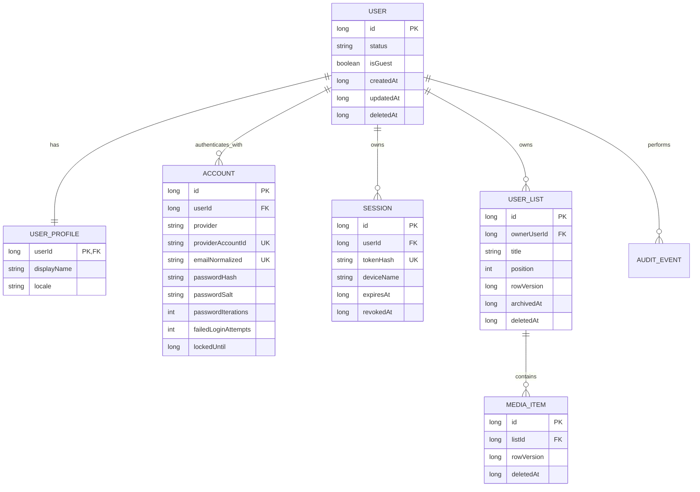

# User accounts and personal lists

## Current state and scope

UltimateTracker is a single-module, local-first Android application built with Kotlin, Jetpack Compose, Room, coroutines, and MVVM. There is no backend, mail service, or OAuth client configuration. Version `alpha-1.1` therefore implements device-local identities and sessions. Email verification, email password-reset delivery, Google OAuth, cross-device sessions, and synchronization require a future server and are intentionally not simulated in the APK.

Existing version-5 installations are migrated to a guest user and a default list without deleting media. A guest may later register; the transaction transfers the guest's active lists to the new user and creates a fresh empty guest list.

## Module boundaries

- `data/local/account` owns Room entities and queries for users, profiles, sign-in accounts, sessions, lists, and audit events.
- `security/Credentials.kt` owns email/password validation, PBKDF2 password hashing, random session-token creation, and SHA-256 token hashing.
- `data/repository/AccountRepository.kt` is the authorization boundary. It creates identities and sessions, verifies credentials, enforces list ownership, and publishes the active identity.
- `data/repository/MediaRepository.kt` accepts no caller-supplied user identity. It always obtains the active list from `ActiveIdentityStore` and includes that list in every query or mutation.
- `viewmodel/AccountViewModel.kt` translates repository state/results for Compose.
- `ui/screens/AuthScreen.kt` and `AccountScreen.kt` provide local authentication and list management.

## Entity relationship diagram

## Schema and indexes

`users.status`, `accounts.userId`, unique `(accounts.provider, accounts.providerAccountId)`, unique nullable `accounts.emailNormalized`, `sessions.userId`, unique `sessions.tokenHash`, `sessions.expiresAt`, `user_lists.ownerUserId`, `(user_lists.ownerUserId, position)`, `media_items.listId`, `(media_items.listId, updatedAt)`, and `(audit_events.userId, createdAt)` are indexed. Child rows cascade when a physical parent deletion is performed. Product operations soft-delete users, accounts, lists, and media where recovery or audit value exists. Password material is erased when an account is deleted. Profile avatars are stored as persisted Android document-provider URIs. They are profile data and are not part of list backup files.

Room migration 5 to 6 creates all identity tables, inserts guest user/list IDs 1, reconstructs `media_items` with a foreign key to `user_lists`, and copies old rows with `listId = 1`, `rowVersion = 1`, and no deletion timestamp. Room executes the migration transactionally and no destructive fallback is configured.

## Local service contracts

The app has repository calls rather than HTTP endpoints:

- `register(email, password, displayName)` validates input, creates `User`, `UserProfile`, local `Account`, default/converted lists, audit event, and session atomically where required.
- `login(email, password)` returns one generic invalid-credentials result, applies a 15-minute lock after five failures, resets the counter on success, and issues a 30-day session.
- `initialize()` restores only a non-expired, non-revoked token whose SHA-256 hash exists in Room.
- `logout()`, `logoutAll()`, and `revokeSession(id)` revoke server-model session rows before removing the local token.
- `createList`, `selectList`, `renameList`, `archiveList`, and `deleteList` first bind the operation to the active user. Rename uses `rowVersion` for optimistic concurrency and reports `Conflict` after a stale write.
- Media observation, lookup, upsert, category update, and soft deletion include the active `listId`; a numeric media ID alone is insufficient.

Results use a closed error model: `InvalidEmail`, `WeakPassword`, `EmailAlreadyUsed`, `InvalidCredentials`, `Locked`, `Conflict`, `NotAllowed`, and `NotFound`. Passwords, hashes, salts, and raw session tokens are never returned in UI state or audit rows.

## Future HTTP API

A server adapter should preserve the same domain boundaries. Suggested routes are `POST /v1/auth/register`, `/login`, `/refresh`, `/logout`, `/password-reset/request`, `/password-reset/confirm`, and `/email/verify`; `GET/PATCH/DELETE /v1/me`; `GET/DELETE /v1/me/sessions/{id}`; CRUD under `/v1/lists`; and item CRUD under `/v1/lists/{listId}/items`. The authenticated user comes only from server middleware, never from a body/query `userId`. A list query must constrain both `id` and `owner_user_id` (or an authorized membership). Responses should use stable error codes and never expose credential columns.

OAuth adds an `Account` row with a provider subject identifier; it does not create a second `User` when linking to an authenticated user. Refresh tokens should be rotated and reuse should revoke the token family. Email-reset and verification tokens should be random, short-lived, one-use, and stored hashed.

## Authorization matrix

Guests and registered users may read and mutate their own active lists and items. Registered users may manage local credentials, sessions, profile, and account deletion. Guests cannot delete the reserved guest identity. No user may read, update, archive, or delete another user's list/item/session. Future `ListMembership` rows may grant `VIEWER` or `EDITOR`; only `OWNER` may manage members or delete a list.

## User scenarios and edge cases

On first launch, the user signs in, registers, or continues as guest. A migrated guest sees the old collection. Switching lists immediately changes the observed media flow. Archiving/deleting the active list selects another active list or creates a default. Signing out clears active identity so media flows emit no records.

Duplicate normalized email, blank/oversized list names, stale rename versions, expired/revoked sessions, deleted users, guessed IDs, last-list deletion, repeated initialization, and interrupted migration are handled. The repository performs ownership checks; UI visibility is not a security control. Concurrent item edits currently use last-write-wins despite carrying `rowVersion`; a future server must require `If-Match` or an expected version for item updates.

## Testing strategy and risks

Pure unit tests cover email/password rules, randomized salted hashing, password verification, and token hashing. Existing ViewModel/search tests protect prior behavior. The Gradle build compiles Room queries/entities, resources, navigation, and Compose. A production release should additionally add instrumented Room migration tests for 5 to 6 and repository integration tests with an in-memory database, including cross-user ID substitution, guest conversion, session expiry/revocation, soft deletion, and concurrent list rename.

The principal limitation is device locality: reinstalling or clearing app data removes accounts, and there is no actual email ownership proof. Android app-private storage and backup policy determine database exposure; a production server-backed release should disable credential backup or encrypt backup data, use Android Keystore for the local active token, add explicit destructive-action confirmations, and perform independent security review.
